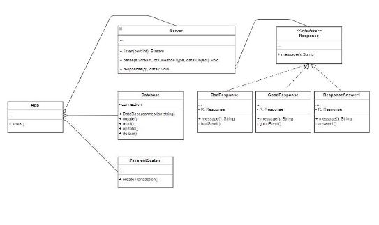
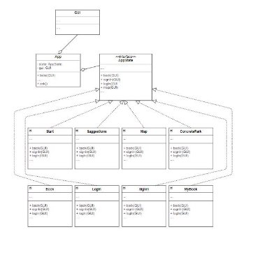
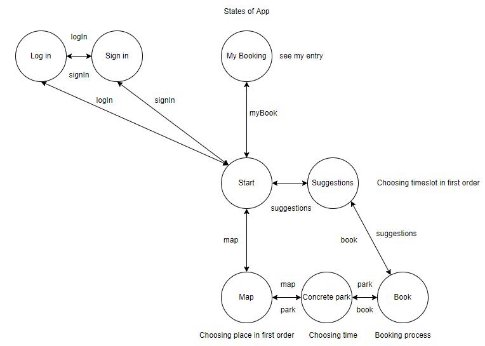

**SSAD: Assignment 4 Report Team number 45**

**Parking Booking System**

Dmitry Batalov, Danil Timofeev,

David Eje and Tanmay Sharma

Innopolis University, 2022

**Contents**

1. [Application Description](#_page2_x72.00_y72.00)
1. [UML Diagram](#_page3_x72.00_y72.00)
1. [Program Description](#_page6_x72.00_y72.00)
1. [Server-Side](#_page6_x72.00_y181.13)
1. Client-Side
1. **Application Description**

The proposed project is a smart parking booking system that provides customers with an easy way of reserving a parking space online. It overcomes the problem of finding a parking space in commercial areas that unnecessarily consumes time. Hence, this project offers a web-based reservation system where users can view various parking areas and select the space to view whether space is available or not. If the booking space is available, then they can book it for a specific time slot. The booked space will be marked in yellow and will not be available for anyone else for the specified time. For demonstration, we will be using 4 parking spaces and each parking space will have 20-minute time slots. This system provides an additional feature of canceling the bookings. Users can cancel their book space anytime. Users can even make payments online via credit card. After making payment, users are notified about the booking via email along with a unique parking number. The client app allows parking booking on android phones. The server-side web service is stored on a web service.

2. **UML Diagram**

**Figure 1.** Server-Side of the Application

**Figure 2.** Client-Side of the application

**UML Description**

Our system architecture contains # classes.

The UML Diagram has two parts: Server-Side and Client-Side.

1. Server-Side follows the Decorator pattern (reasons will be mentioned in the program description).

The Database, PaymentSystem, and Server classes are connected to the App class using the aggregation link which means that if App is discarded, its parts (mentioned above) will be deleted.

The interface Response is connected to the Server class using the aggregation link too.

Meanwhile, the BadResponse, GoodResponse, ResponseAnswer1 are connected to the Response interface using the realization link which means the implementing class that is realizing classifiers conforms to the contract defined by the interface Response.

2. Client-Side follows the State pattern (reasons will be mentioned in the program description). The state classes are also connected to the AppState interface using the realization link, meanwhile the GUI class and the AppState interface are connected to the App class using the aggregation link.

Here, the App class is the Context that defines an interface for the client to interact. It maintains references to concrete state objects, which may be used to define the current state of the object.

The AppState class is the State which defines the interface for declaring what each concrete state should do.

The Start, Suggestions, Map, ConcretePark, Book, MyBooking, Login and Signup classes are the ConcreteState that provides the implementation for methods defined in State.

3. **Program Description**

The system has two different parts:

1) Server-Side
1) Client-Side
1. **Server-Side**

The server responds to the queries by the client-server by answers. It starts with the server:

1) Perceiving the port and returning a stream to the user.
1) User makes the request to the server, for example asking questions like: “Is there any place?”.
1) Stream is the raw data. The parser will make parse the main arguments of the questions which are in this example will be: Place: “there”, request: to check if there is any spot available or not.
1) Server responses and answer1-N decorate this response with respect to QuestionType as asked by the user.
1) Response() class gets called and is sending a response.
1) answerK() is about real actions the server does.

**Figure 3.** The Server Side has to answer different questions (extendable). It has a payment system and a database which contains the above-mentioned tables.

**For different questionTypes from client server should send different responses. Some of them might be co-inside. For example, BadResponse & Response404, etc. Decorator Pattern helps us to combine several questions and answers in a single request.**

2. **Client-Side**

The client-side of the application is the one that generates questions and provides the user experience. The questions that can be asked must be extendable, that is, adding new classes to the existing system must be possible. The client class should also be able to receive and process different responses transferred by the server.

**Figure 4.** Client-side and the server-side

interacting with each other.

The client-side of the application can perform various operations requested by the user, such as:

1) Booking a spot in a Concrete place(park) for a period of time specified by the user.
1) Booking a suitable spot that is the nearest available at a particular time when requested by the user.

The implementation of the client-side doesn’t actually depend on the UI/UX design of the application. The UI/UX design is easy to extend whenever any new modifications are made to the application.

**The client-side follows the State Design pattern as the application changes its behavior throughout the execution time based on its internal state.**

The Login/SignUp classes implement the logic for the typical user access system (including the users registering a new account and logging in to the account, providing login and password).

After logging in to the application with verified credentials, the user reaches the Start state of the application. From here, the user can perform various operations like searching the map, checking pre-booked bookings, and looking for suggestions.

The Map State allows the user to go through the real-time locations and find a suitable spot for parking. The user can mark this location and then move on to choosing a suitable time for the parking. Reaching the ConcretePark class, the user has the possibility of choosing a specified time by the time availability of the spot. If the spot is available, then the user will be able to select the time and move on to finally book the place, otherwise, he/she will be asked to select another available time.

At the Book class, the user will be finally able to book the desired or best-available spot for parking by confirming the payment made. From here users can move on to the suggestions state which suggests users different place-time slots which may be suitable for him/her. The Suggestions class will show different various available places of time slots that are convenient for the user based on their activity.

The MyBooking class displays a list of bookings made by the user over the pastime that helps him/her to keep a track of the places. The application can use this information to display suggestions in the future.

The User will interact with the client-side in the following way by transferring from one state to another in the following manner:

